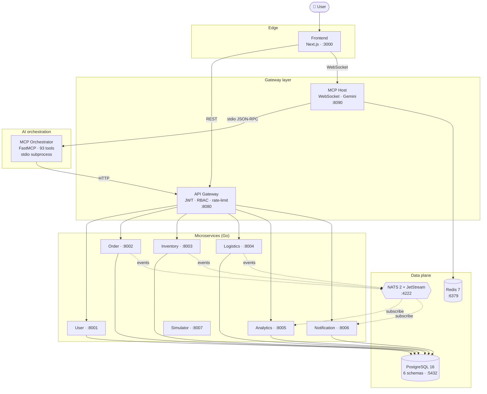
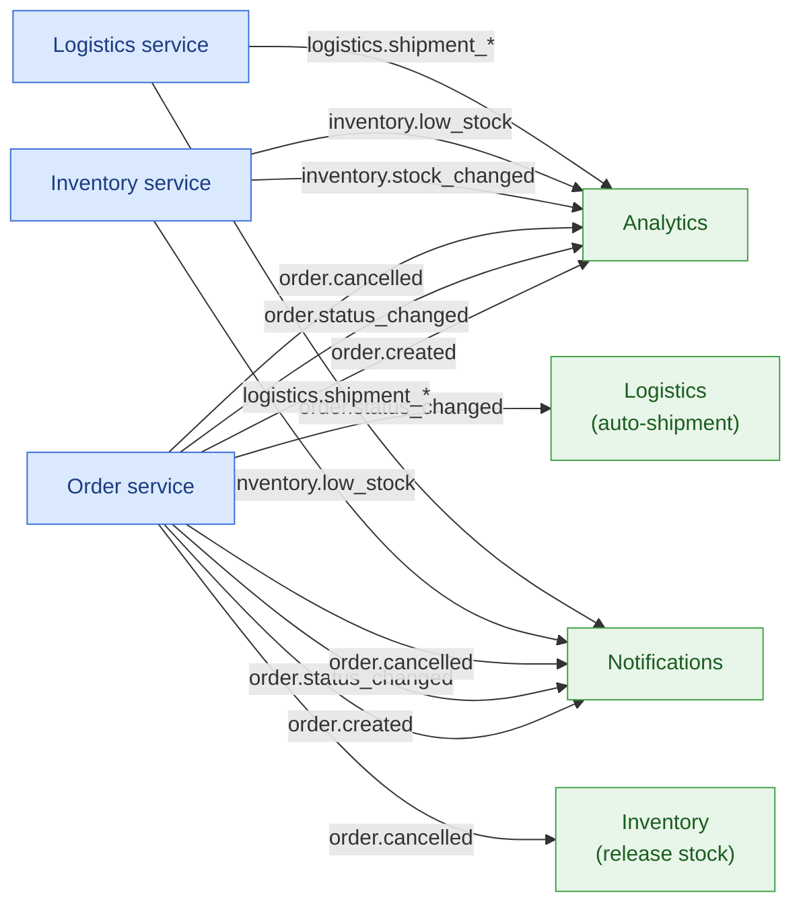

# ChainOrchestra — AI-Powered Supply Chain Platform

Enterprise-grade supply chain management platform with an AI orchestration layer built on **MCP (Model Context Protocol)**. The platform combines traditional UI-driven workflows with a natural language chat interface that translates user intents into automated multi-step workflows across microservices.

## Key Features

- **7 microservices** (Go): Orders, Inventory, Logistics, Analytics, Notifications, Users, Simulator
- **API Gateway** with JWT authentication, RBAC, rate limiting, CORS, SSE real-time stream
- **MCP Orchestrator** (Python/FastMCP): 93 tools spanning all business domains
- **MCP Host** (Python/FastAPI): WebSocket chat with Google Gemini LLM integration
- **Frontend** (Next.js 16, React 19, TypeScript): role-aware dashboard, data tables, charts, real-time chat, live activity feed
- **Event-driven architecture**: NATS for inter-service communication; SSE bridge to UI for real-time updates
- **Live simulation**: a dedicated simulator service generates continuous order/shipment/inventory traffic with 5 scenarios and 1×–50× time multiplier — dashboards and analytics update in real time
- **RBAC**: 5 roles (Admin, Operator, Warehouse Manager, Logistics Manager, Analyst)

## Architecture



For an extended diagram with sequence flows, see [docs/architecture.md](docs/architecture.md).

## Quick Start

### Prerequisites

- **Docker** and **Docker Compose** (v2+)
- **Gemini API key** (for AI chat features) — get one at Google AI Studio
- Ports 3000, 4222, 5432, 6379, 8001-8006, 8080, 8090 must be free

### 1. Clone and configure

```bash
git clone <repo-url> chainorchestra
cd chainorchestra
cp .env.example .env
```

Edit `.env` and set your `GEMINI_API_KEY`:

```env
GEMINI_API_KEY=your_actual_gemini_api_key
JWT_SECRET=your_random_32_char_hex_string
```

### 2. Start all services

```bash
docker compose up --build -d
```

This starts 15 containers in the correct dependency order:
`postgres` / `redis` / `nats` → 6 Go services → `api-gateway` → `simulator-service` / `mcp-host` → `frontend` → `prometheus` / `grafana`

Wait for all services to become healthy:

```bash
docker compose ps
```

All services should show `(healthy)` status. First startup takes ~2 minutes for builds.

### 3. Seed test data

```bash
./scripts/seed.sh
```

Creates: 5 users, 20 products, 3 warehouses, 3 carriers, 10 orders, 5 shipments, 60 stock entries.

### 4. Access the application

| URL | Service |
|-----|---------|
| http://localhost:3000 | Frontend (web UI) |
| http://localhost:8080 | API Gateway |
| http://localhost:8090 | MCP Host (WebSocket chat) |

### 5. Login

Default admin credentials (configured in `.env`):

```
Email:    admin@chainorchestra.local
Password: admin123
```

Other test users created by seed script:

| Role | Email | Password |
|------|-------|----------|
| Operator | operator@chainorchestra.local | operator123 |
| Warehouse Manager | warehouse@chainorchestra.local | warehouse123 |
| Logistics Manager | logistics@chainorchestra.local | logistics123 |
| Analyst | analyst@chainorchestra.local | analyst123 |

### 6. Try the AI chat

Click the chat icon in the top bar and ask:

```
List all orders
Show me low stock items
Create an order for customer John with 5 units of any product
What are the sales trends for last month?
```

## Tech Stack

| Layer | Technology |
|-------|-----------|
| Backend | Go 1.25, net/http, pgx/v5, zap, NATS |
| Frontend | Next.js 16, React 19, TypeScript, TailwindCSS, Zustand, TanStack Query, Recharts |
| AI/MCP | Python 3.10+, FastMCP, FastAPI, Google Gemini (google-genai) |
| Database | PostgreSQL 16 (6 schemas), Redis 7 |
| Messaging | NATS 2 with JetStream |
| Infrastructure | Docker Compose, multi-stage Dockerfiles |

## Project Structure

```
chainorchestra/
├── services/                   # Go microservices
│   ├── api-gateway/            # JWT validation, routing, rate limiting
│   ├── user-service/           # Auth, user management
│   ├── order-service/          # Order CRUD, status workflow
│   ├── inventory-service/      # Products, warehouses, stock
│   ├── logistics-service/      # Shipments, carriers, routes
│   ├── analytics-service/      # Dashboards, anomalies, reports
│   ├── notification-service/   # In-app, WebSocket push, mock email/SMS
│   └── simulator-service/      # Live traffic generator (orders/shipments/stock/notifications)
├── internal/pkg/               # Shared Go packages
│   ├── auth/                   # JWT generation/validation
│   ├── httpresponse/           # Standard JSON response format
│   ├── middleware/              # Logging, CORS, recovery, request ID, user context
│   ├── nats/                   # NATS client, event envelope
│   ├── pagination/             # Page, Sort, Filter types
│   ├── postgres/               # pgx connection pool
│   └── validate/               # Validation wrapper
├── mcp-orchestrator/           # MCP Server (Python) — 93 tool definitions
├── mcp-host/                   # MCP Host (Python) — WebSocket, Gemini, RBAC
├── frontend/                   # Next.js web application
├── scripts/                    # Seed data, E2E tests
├── docker/                     # Docker-related configs (postgres init)
├── docs/                       # Documentation
│   ├── architecture.md         # Architecture diagram (Mermaid)
│   ├── api-reference.md        # REST API endpoints
│   └── mcp-tools.md           # MCP tools catalog
├── docker-compose.yml          # Full-stack orchestration
└── .env.example                # Environment variables reference
```

## Documentation

- [Architecture Diagram](docs/architecture.md) — system components and data flow (Mermaid)
- [API Reference](docs/api-reference.md) — all REST endpoints per service
- [MCP Tools Reference](docs/mcp-tools.md) — complete catalog of 93 MCP tools
- [Typed MCP Tools](docs/typed-tools.md) — strict Pydantic types so the LLM can't pass wrong shapes silently
- [LLM Error Codes](docs/error-codes.md) — structured `{code, field, expected, suggestion, examples}` envelope
- [Observability & Tracing](docs/observability.md) — Logfire spans, audit trace by `entity_id`, token budgets, loop guard
- [Integration Tests](docs/integration-tests.md) — running the E2E test suite
- [Demo Scenarios](docs/demo-scenarios.md) — RBAC + chat workflows for live demo

## Running Tests

### Go unit tests

```bash
go test ./...
```

### E2E integration tests (requires running stack + seed data)

```bash
# REST API tests
./scripts/e2e-test.sh

# Auth flow tests
./scripts/e2e-auth-test.sh

# WebSocket MCP chat tests (requires: pip install websockets)
python3 scripts/e2e-ws-test.py
```

## Environment Variables

See [.env.example](.env.example) for the complete reference. Key variables:

| Variable | Description | Default |
|----------|-------------|---------|
| `GEMINI_API_KEY` | Google Gemini API key (required for chat) | — |
| `GEMINI_MODEL` | Gemini model ID | `gemini-2.5-flash` |
| `JWT_SECRET` | JWT signing secret | `dev-secret-change-me` |
| `POSTGRES_PASSWORD` | PostgreSQL password | `postgres` |
| `TOOL_TIMEOUT` | MCP tool call timeout (seconds) | `30` |
| `SESSION_TTL` | Chat session TTL (seconds) | `1800` |
| `MAX_TOOL_ROUNDS` | Max tool calls per chat turn | `10` |

## RBAC Roles

| Role | Access |
|------|--------|
| **Admin** | All services and MCP tools |
| **Operator** | Orders, Notifications |
| **Warehouse Manager** | Products, Stock, Warehouses, Orders (read), Notifications |
| **Logistics Manager** | Shipments, Carriers, Routes, Orders (read), Notifications |
| **Analyst** | Analytics, Reports |

## NATS Event Flow



## License

Diploma project — University internal use.
