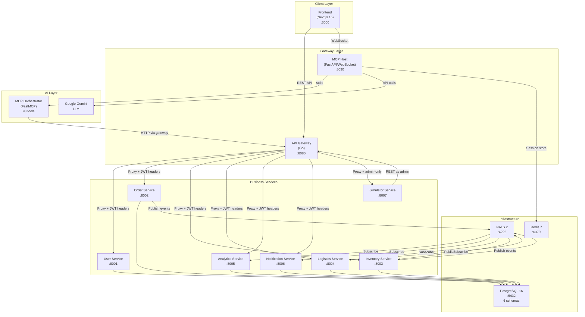
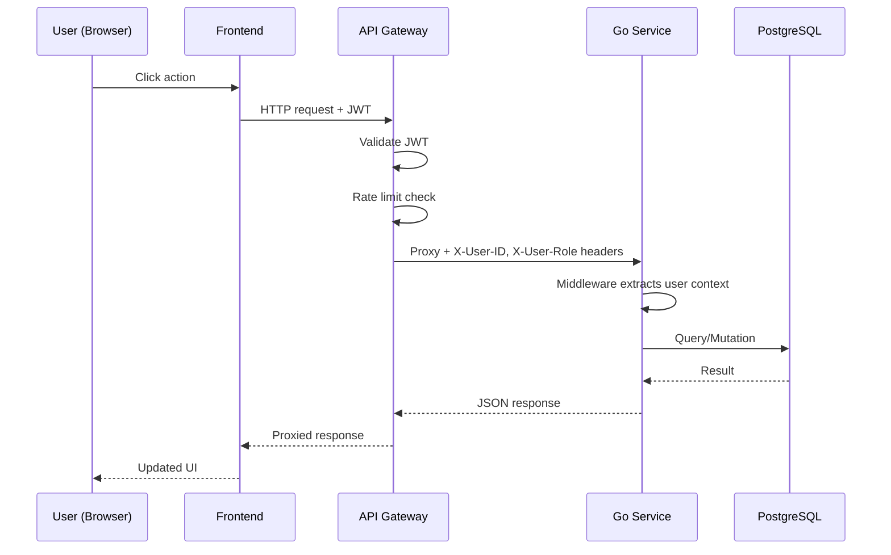
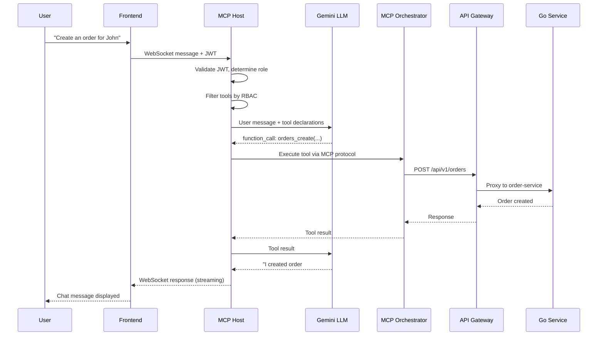
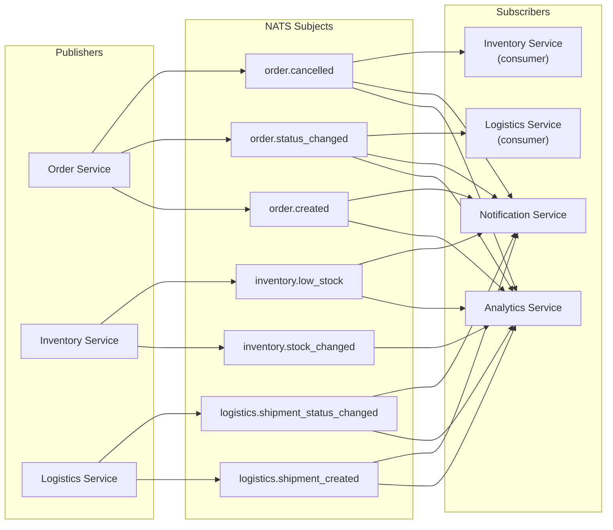
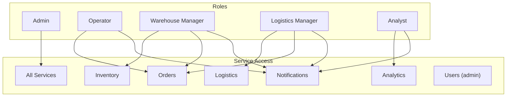

# Architecture

## System Overview

ChainOrchestra is a microservice-based supply chain management platform with an AI orchestration layer. The system consists of 15 containers orchestrated via Docker Compose, including a dedicated simulator-service that generates continuous traffic to validate the platform under real-world load.



## Request Flow

### Traditional UI Flow



### MCP Chat Flow



## Database Schema Layout

Each service owns its own PostgreSQL schema within the shared `chainorchestra` database:

| Schema | Service | Tables |
|--------|---------|--------|
| `users` | user-service | `users`, `password_reset_tokens` |
| `orders` | order-service | `orders`, `order_items` |
| `inventory` | inventory-service | `products`, `warehouses`, `stock`, `stock_movements` |
| `logistics` | logistics-service | `carriers`, `shipments`, `routes` |
| `analytics` | analytics-service | `sales_daily`, `inventory_snapshot`, `logistics_daily` |
| `notifications` | notification-service | `notifications`, `notification_preferences` |

## NATS Event Flow



## RBAC Model



## Middleware Chain

Every request through the API Gateway passes through:

```
RequestID → CORS → Recovery → Logging → RateLimit → JWT → Proxy → Service
```

Each Go service then applies:

```
UserContext (extract X-User-ID/X-User-Role from headers) → Handler
```

## Technology Decisions

| Decision | Choice | Rationale |
|----------|--------|-----------|
| Go for services | Go 1.25 + net/http | Performance, strong typing, simple deployment |
| PostgreSQL schemas | Single DB, multiple schemas | Isolation without operational overhead |
| NATS | NATS 2 with JetStream | Lightweight, Go-native, persistent messaging |
| MCP protocol | FastMCP (Python) | Standard protocol for LLM tool integration |
| Gemini | google-genai SDK | Function calling support, fast inference |
| Next.js | v16 with App Router | Modern React patterns, SSR-ready |
| Redis | v7 | Session storage, plan caching, TTL support |
